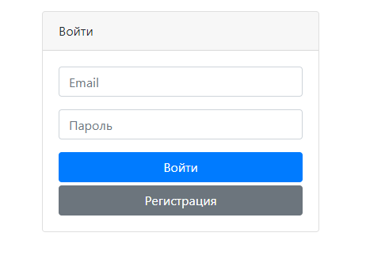
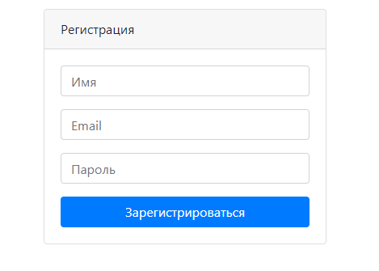
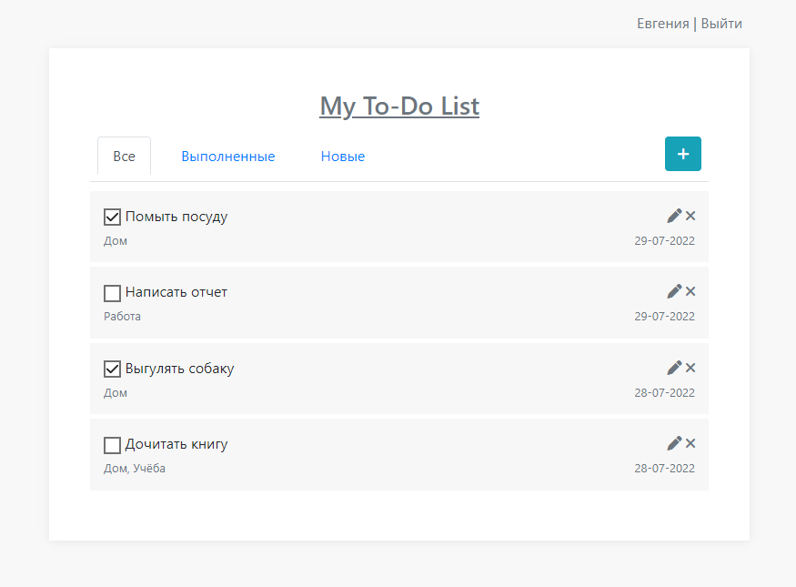
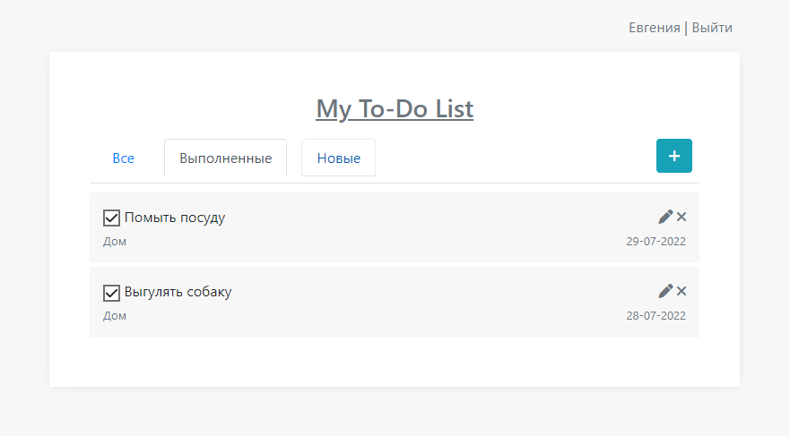
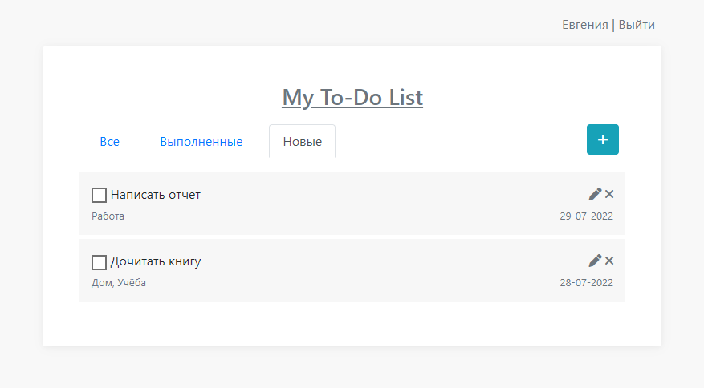
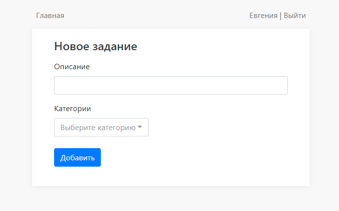
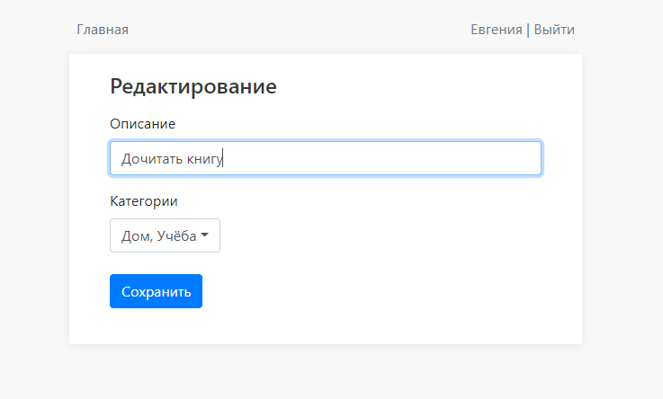

Учебный мини-проект в рамках курса job4j

Используемые технологии: Spring Boot, Hibernate, Bootstrap, Thymeleaf, JQuery, PostgreSQL, Liquibase

Реализованные возможности:
- Регистрация и авторизация
- Создание заданий с выбором категорий
- Изменение статуса выполнения задания
- Редактирование и удаление задания

